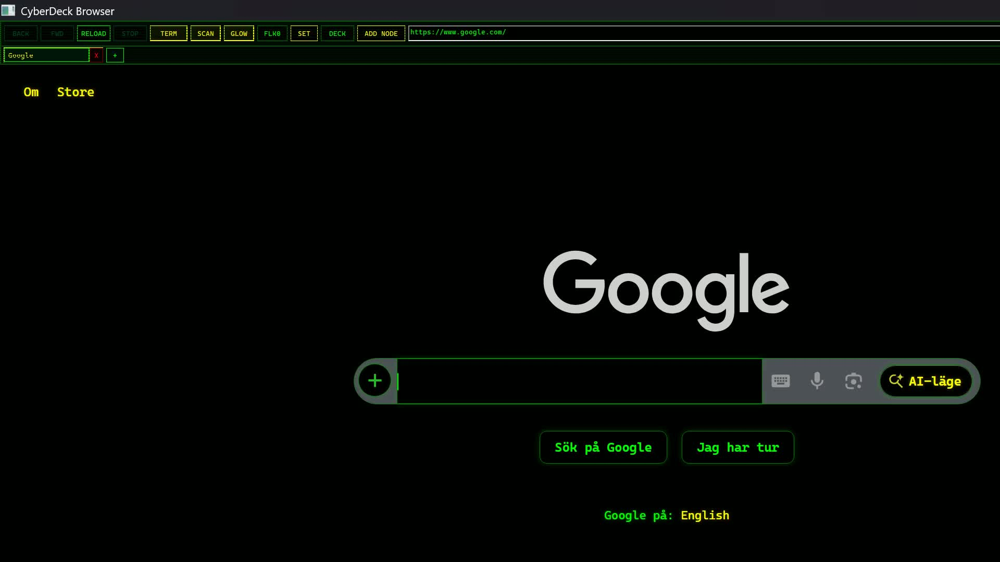
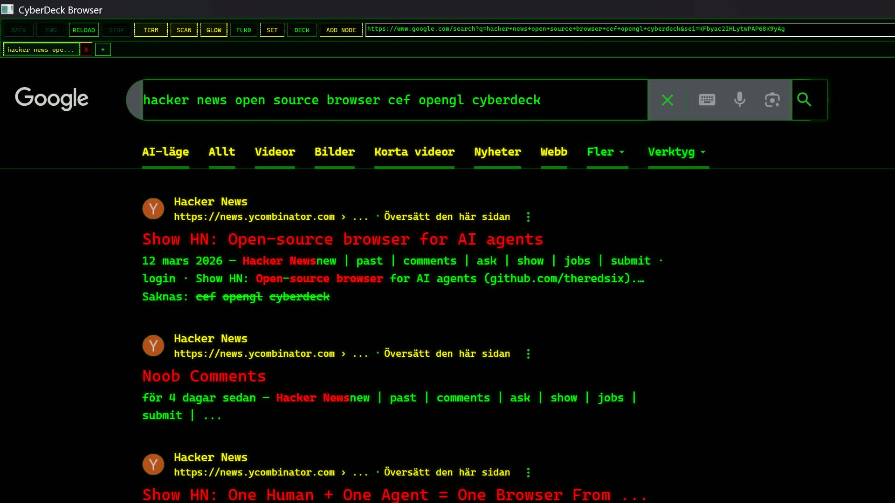
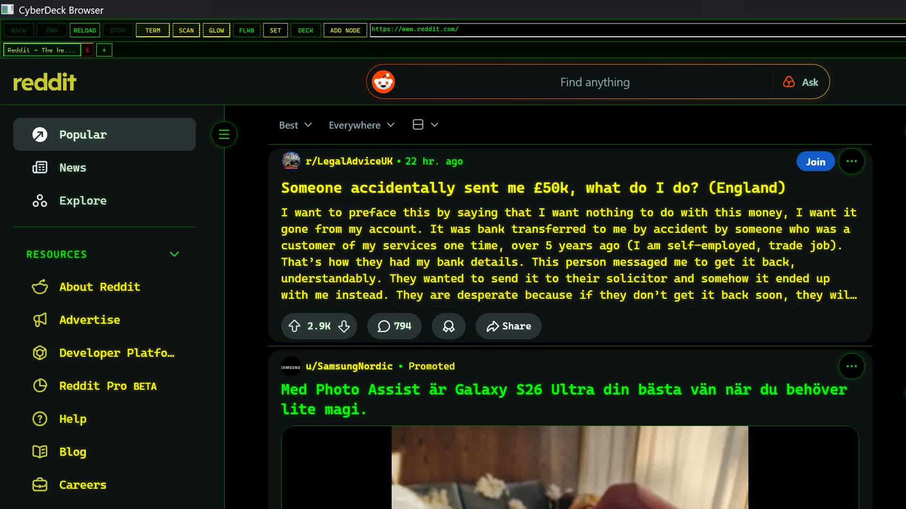
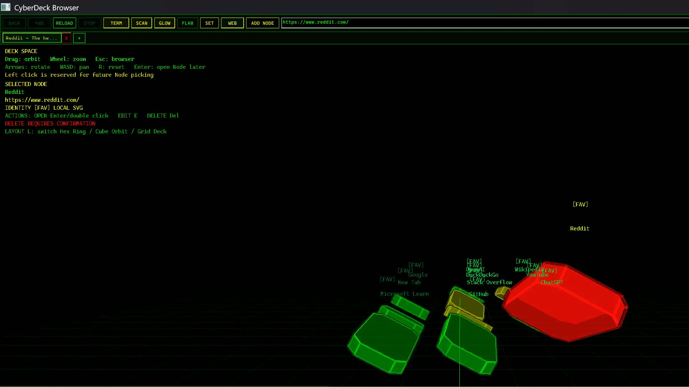
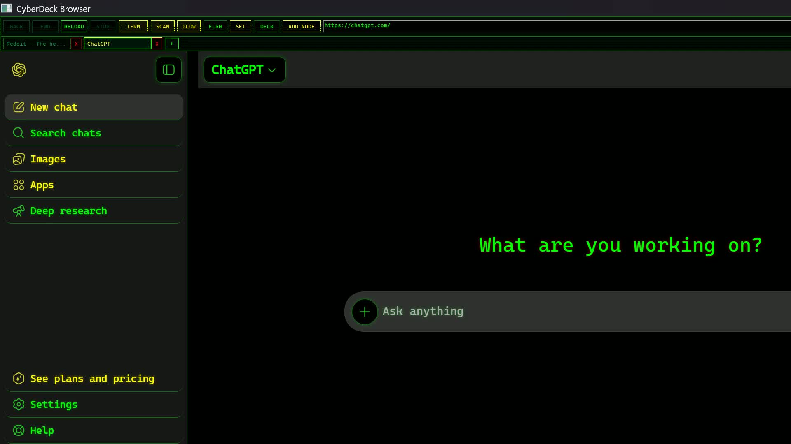

# CyberDeck Browser

CyberDeck Browser is a native Windows 11 desktop browser shell written in
C++20. It uses Chromium Embedded Framework (CEF) for normal website rendering
and a native OpenGL view for Deck Space, a retro-futuristic 3D bookmark system
where bookmarks are called Nodes.

The visual identity is a black terminal-style interface with neon green text,
yellow highlights, red warnings/actions, monospace controls, and optional CRT
scanline/glow effects. OpenGL is used for the app shell and Deck Space, not as a
replacement for Chromium rendering.

## Promo Videos

The repository includes compact x265 promo cuts captured from the portable CEF
build:

- [Promo with text overlays](docs/media/cyberdeck-browser-promo-withtext-x265.mp4)
- [Promo without text overlays](docs/media/cyberdeck-browser-promo-notext-x265.mp4)

## Screenshots

| Terminal Mode | Nerdy Search |
| --- | --- |
|  |  |

| Reddit | Deck Space |
| --- | --- |
|  |  |

| Node Opened |
| --- |
|  |

More usage notes are in [docs/USER_GUIDE.md](docs/USER_GUIDE.md). Media
capture details are in [docs/MEDIA.md](docs/MEDIA.md).

## Feature Overview

- CEF-powered browsing for normal websites.
- Native Win32 toolbar, tab strip, status panels, and diagnostics.
- Terminal Mode CSS injection for black/green/yellow/red cyberdeck styling.
- CRT shell effects: scanlines, glow, and flicker controls.
- Local history, settings, logs, and Deck Space Nodes stored as JSON.
- Deck Space: OpenGL 3D bookmark world with hex/cube/panel Nodes.
- Node workflows: Add Node, select/open, edit, delete, layout switching.
- OpenGL diagnostics for GPU vendor, renderer, and version.
- Windows installer scaffolding through Inno Setup.

## Dependencies

- Windows 11
- Visual Studio 2022 with MSVC C++ tools for CEF-enabled builds
- CMake 3.24 or newer
- Official Windows CEF binary distribution
- Inno Setup 6 for installer creation
- A GPU/driver with compatible OpenGL support for Deck Space

This repository can also build a placeholder non-CEF shell. That mode is useful
for local development of native UI and Deck Space plumbing, but it is not a
functional web browser release.

## CEF Setup

CEF binaries are not committed to this repository. Download an official Windows
CEF binary distribution, extract it locally, then configure with `CEF_ROOT`:

```powershell
cmake -S . -B build -DCEF_ROOT="C:\path\to\cef_binary" -DCYBERDECK_REQUIRE_CEF=ON
cmake --build build --config Debug
```

Use Visual Studio 2022 or Ninja from an MSVC developer shell. Official Windows
CEF binaries are not link-compatible with the MinGW toolchain used by the local
placeholder build.

More details are in `docs/CEF_SETUP.md`.

## Build

Debug build:

```powershell
cmake -S . -B build -DCEF_ROOT="C:\path\to\cef_binary" -DCYBERDECK_REQUIRE_CEF=ON
cmake --build build --config Debug
```

Release build helper:

```powershell
.\scripts\build_release.ps1 -CefRoot "C:\path\to\cef_binary" -RequireCef
```

Placeholder non-CEF build:

```powershell
cmake -S . -B build
cmake --build build
```

## Run

Multi-config generators such as Visual Studio usually place the app under the
configuration folder:

```powershell
.\build\Debug\CyberDeckBrowser.exe
.\build\Debug\CyberDeckBrowser.exe "https://www.example.com"
```

Single-config generators such as Ninja usually place the app at:

```powershell
.\build\CyberDeckBrowser.exe
.\build\CyberDeckBrowser.exe "https://www.example.com"
```

Inside the app:

- `ADD NODE` saves the current page as a Deck Space Node.
- `DECK` enters/exits Deck Space.
- `TERM` toggles Terminal Mode CSS injection for loaded pages.
- `SCAN`, `GLOW`, and `FLK` adjust native CRT shell effects.
- `SET` opens settings and diagnostics, including CEF state, data paths, OpenGL
  renderer details, and log path.

## Packaging

CyberDeck Browser uses Inno Setup for Windows installer packaging.

```powershell
.\scripts\build_release.ps1 -CefRoot "C:\path\to\cef_binary" -RequireCef
.\scripts\package_installer.ps1
```

If Inno Setup is not on `PATH`, pass the compiler path:

```powershell
.\scripts\package_installer.ps1 -IsccPath "C:\Program Files (x86)\Inno Setup 6\ISCC.exe"
```

To stage files without compiling the installer:

```powershell
.\scripts\package_installer.ps1 -SkipCompile
```

Packaging details are in `docs/PACKAGING.md`.

## User Data

Runtime user data is stored under:

```text
%APPDATA%\CyberDeckBrowser
```

Important files and folders:

- `settings.json` - theme, shell, and Deck Space preferences.
- `history.json` - local navigation history.
- `bookmarks.json` - Deck Space Nodes.
- `favicons\` - local placeholder favicon assets for Nodes.
- `logs\cyberdeck.log` - diagnostics log with size-based rotation.

Invalid JSON files are recovered by renaming the corrupted file and creating a
fresh default file where recovery is implemented.

## QA And Release

Use `docs/QA_CHECKLIST.md` before tagging a release candidate. Use
`docs/RELEASE_NOTES_TEMPLATE.md` to prepare release notes.

Useful docs:

- [User Guide](docs/USER_GUIDE.md)
- [Bookmark Node Model](docs/BOOKMARK_NODE_MODEL.md)
- [CEF Setup](docs/CEF_SETUP.md)
- [Packaging](docs/PACKAGING.md)
- [Promo Media](docs/MEDIA.md)
- [QA Checklist](docs/QA_CHECKLIST.md)

## Known Limitations

- A production browser release requires a CEF-enabled MSVC build. The non-CEF
  placeholder build does not render websites.
- Real favicon capture from CEF is not implemented yet; Deck Space currently
  uses local placeholder favicon badges.
- Deck Space thumbnails are not implemented.
- Installer compilation requires Inno Setup 6 on the packaging machine.
- The installer is not signed and there is no auto-update channel.
- No clean Windows VM install/uninstall pass has been completed in this
  environment.
- `ctest` currently finds no registered tests; test executables are run
  directly for local verification.
- This project has not received a full production security audit.
